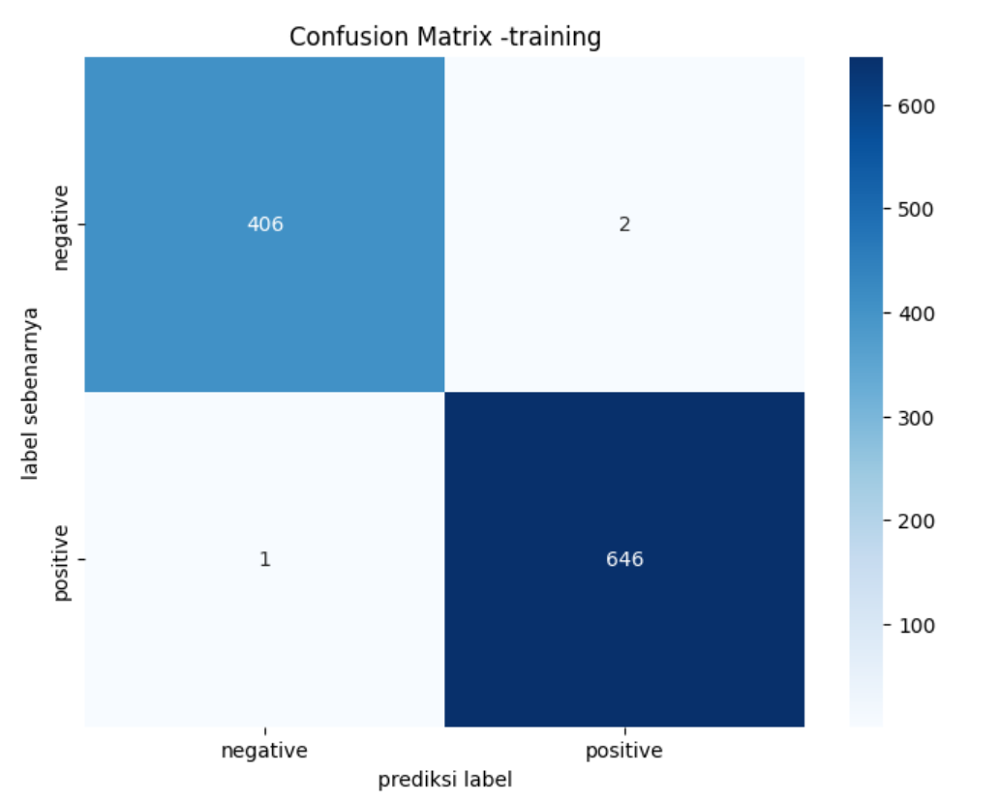
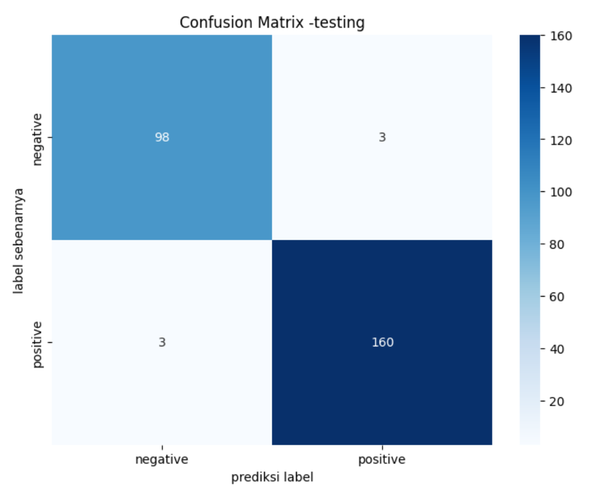

# Klasifikasi Penyakit Jantung Menggunakan Algoritma Decision Tree

Proyek ini bertujuan untuk merancang sistem klasifikasi penyakit jantung berdasarkan data medis menggunakan algoritma **Decision Tree**. Penelitian ini difokuskan untuk meningkatkan akurasi deteksi dini penyakit jantung, mengingat tingginya tingkat kematian akibat penyakit ini secara global.

---

## Tools & Teknologi
- Python (Google Colab / Jupyter)
- Pandas, NumPy
- Scikit-learn
- Matplotlib, Seaborn
- GridSearchCV, RandomSearch, Bayesian Optimization (untuk hyperparameter tuning)

---

## Dataset
Dataset diambil dari [Kaggle – Heart Disease Classification Dataset](https://www.kaggle.com/datasets/bharath011/heart-disease-classification-dataset/data), terdiri dari **1025 sampel pasien** dengan **9 atribut**, termasuk:
- Usia
- Jenis kelamin
- Detak jantung
- Tekanan darah
- Kadar glukosa
- Enzim jantung (kcm, troponin)
- Status serangan jantung (positif/negatif)

---

## 🔁 Proses Analisis
1. **Preprocessing Data**: normalisasi, encoding, dan transformasi label
2. **Stratified Splitting**: pembagian data menjadi 70% train, 15% validasi, 15% test
3. **Modeling**: klasifikasi menggunakan Decision Tree
4. **Validasi**: 10-fold cross-validation dan repeated cross-validation
5. **Optimasi**: Grid Search, Random Search, dan Bayesian Optimization
6. **Evaluasi**: Confusion Matrix, Akurasi, Presisi, Recall, F1-Score, AUC-ROC
7. **Learning Curve Analysis**: untuk mendeteksi underfitting/overfitting

---

## Hasil Evaluasi
| Metrik          | Nilai      |
|-----------------|------------|
| **Akurasi**     | 97.72%     |
| **Presisi (+)** | 98%        |
| **Recall (+)**  | 98%        |
| **F1-Score (+)**| 98%        |
| **Presisi (–)** | 97%        |
| **Recall (–)**  | 97%        |
| **F1-Score (–)**| 97%        |

Hasil dari penelitian menyatakan bahwa algoritma Decision Tree bekerja dengan baik dalam mengklasifikasikan penyakit jantung melalui data pasien. Hal tersebut dibuktikan melalui hasil penelitian dengan hasil Akurasi sebesar 97.72%. untuk kelas Negatif didapati hasil Presisi sebesar 97% Recall sebesar 97%, dan F1-score sebesar 97%. Selain itu, pada kelas Positif didapati hasil Presisi sebesar 98% Recall sebesar 98%, dan F1- score sebesar 98%. Dari hasil Recall, Presisi, dan F1-score yang tidak terlalu memiliki perbedaan yang jauh membuktikan bahwa model mampu menilai untuk tiap kelas secaraadil atau tidak bias. Namun, pada tabel Confusion matrix model memiliki kesalahan kecil klasifikasi, yaitu masing-masing 3 kasus untuk false positive dan false. Dalam konteks medis, terutama untuk kasus false negative, kesalahan ini bisa berakibat fatal karena berpotensi menunda penanganan medis pada pasien yang sebenarnya membutuhkan.

---

## 📷 Visualisasi

---
